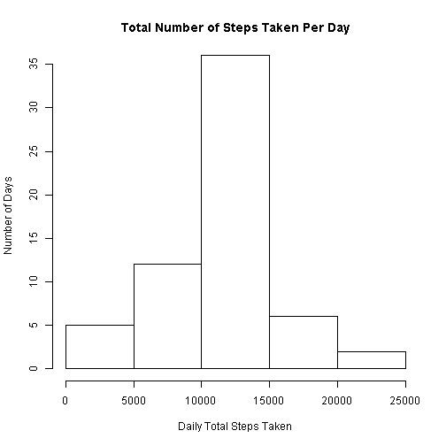
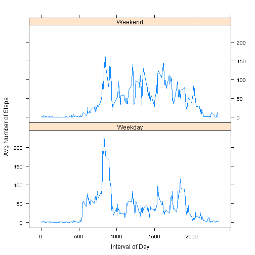

## Activity Monitoring Data Analysis

This assignment makes use of data from a personal activity monitoring device.  
This device collects data at 5 minute intervals through out the day.  
The data consists of two months of data from an anonymous individual collected  
during the months of October and November, 2012 and include the number of steps  
taken in 5 minute intervals each day.


## Loading and preprocessing the data

The data set is read in and summarized by date. Missing values (NA) are ignored.  


```r
## Unzip the data file
## Assumes the zip file is in the current working directory
unzip("activity.zip")

## Read in the data file, known to be csv format
act <- read.csv("activity.csv")

## Load dplyr package
library(dplyr)

## Get total steps per day, ignore NAs
day_act <- summarise(group_by(act,date),
                     daily_steps=sum(steps)
                     )
```


## What is mean total number of steps taken per day?

```r
## Get mean & median steps per day
mean_steps <- as.integer(mean(day_act$daily_steps, na.rm=TRUE))
med_steps <- as.integer(median(day_act$daily_steps, na.rm=TRUE))
## inline code below does not echo, so explicitly get results here
mean_steps
```

```
## [1] 10766
```

```r
med_steps
```

```
## [1] 10765
```
The mean total number of steps is 10766. The median total steps is 10765.  

## Histogram of total steps taken per day  


```r
## 61 days, so bin 10 days or set breaks=6
## set ylim based on exploratory plot, keeping same limit for later comparison
hist(day_act$daily_steps,
     main="Total Number of Steps Taken Per Day", 
     ylab="Number of Days", 
     xlab="Daily Total Steps Taken",
     ylim=c(0,35), 
     breaks=6
)
```

 


## What is the average daily activity pattern?  
The data is summarised by interval (5 min periods throughout each day), and the average of each interval is plotted here to visualize the average daily activity pattern.  


```r
## Get mean of each interval across all days, ignore NAs
int_act <- summarise(group_by(act,interval),
                     int_steps=mean(steps,na.rm=TRUE)
                     )

## Make a line plot of the means steps in each interval across all days
plot(int_act$interval,int_act$int_steps,
     type="l",
     main="Average Number of Steps by Interval of Day",
     xlab="Interval of Day",
     ylab="Avg Number of Steps")
```

 

We also want to know in which 5 minute interval of the day the maximum number of steps were taken.  

```r
## Find the interval with the max number of steps on average
max_steps <- as.integer(max(int_act$int_steps))
max_int <- as.integer(int_act[int_act$int_steps == max(int_act$int_steps),1])
## inline code below does not echo, so explicitly get results here
max_steps
```

```
## [1] 206
```

```r
max_int
```

```
## [1] 835
```
We find the maximum steps (206) were taken in the 835 interval.

## Imputing missing values

```r
## Find number of NA entries in steps, use inline code
NA_steps <- as.integer(sum(is.na(act$steps)))
## inline code below
NA_steps
```

```
## [1] 2304
```

Because the data set contains 2304 missing values (NA), we want to know if the results will vary if we fill in those missing values.  
It is felt that inactive periods will be consistent (sleeping, for example) and active periods possibly consistent as well.  
The average steps for each interval are therefore calculated and used in place of the missing values.  


```r
## New df, add column which is steps column with NA replaced with interval mean
act1 <- merge(act,int_act,by="interval")

## Impute mean of interval to NA rows
act1$steps[is.na(act1$steps)] <- act1$int_steps[is.na(act1$steps)]

## Get total steps per day of new data set
day_act1 <- summarise(group_by(act1,date),
                     daily_steps=sum(steps)
)

## Get new mean & median steps per day, and difference from mean of omitted NA data set
imp_mean_steps <- as.integer(mean(day_act1$daily_steps))
mean_diff <- imp_mean_steps - mean_steps
imp_med_steps <- as.integer(median(day_act1$daily_steps))
med_diff <- imp_med_steps - med_steps
## Results used in inline code below:
imp_mean_steps
```

```
## [1] 10766
```

```r
imp_med_steps
```

```
## [1] 10766
```

```r
mean_diff
```

```
## [1] 0
```

```r
med_diff
```

```
## [1] 1
```
The mean number of steps per day, with NA values filled by average of interval, is 10766.  
This differs from the mean of only the valid data by 0.  

The median number of steps per day, with NA values filled by average of interval, is 10766.  
This differs from the median of only the valid data by 1.  

We also look at a histogram of the total steps per day with the missing values filled in.  
 

```r
## Histogram of total steps taken per day with imputed values for NA
## 61 days, so bin ~10 days or breaks = 6
hist(day_act1$daily_steps,
     main="Total Number of Steps Taken Per Day", 
     ylab="Number of Days", 
     xlab="Daily Total Steps Taken",
     ylim=c(0,35),
     breaks=6
)
```

 

This shows more days with the average number of steps as expected. Days with more or less steps than average are not affected.

## Are there differences in activity patterns between weekdays and weekends?  

We will group the data by weekend/weekday and plot to see if the patterns differ.  

```r
## Make new column for separating Weekends / Weedays
act1$weekday <- weekdays(as.Date(act1$date))
act1$weekday[act1$weekday == "Saturday" | act1$weekday == "Sunday"] <- "Weekend"
act1$weekday[act1$weekday != "Weekend"] <- "Weekday"
## Make this column a factor for panel plot
act1$weekday <- as.factor(act1$weekday)

int_act1 <- summarise(group_by(act1,interval,weekday),
                     int_steps=mean(steps)
                     )

## Use lattice plotting
library(lattice)

## Plot
xyplot(int_steps ~ interval | weekday, int_act1, 
       type="l",
       xlab="Interval of Day",
       ylab="Avg Number of Steps",
       layout=c(1,2))
```

 

The patterns suggest earlier activity during the week and perhaps more activity in the middle of the day on weekends.  
